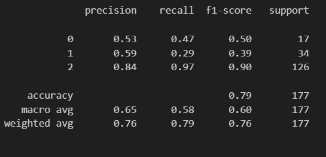

# NLP_Distilbert_Review_Consument
<p align="left">
<a  href= "https://github.com/psf/black">
  </a>
  
</p>

## Tools
<p align="left">
  
  
  
  </p>


## Objective

- Make model with data text review cloth with transfer learning distilbert/distilbert-base-uncased
- Make a API with FastAPI
- Hyperparameter Reference using with this paper [Journal Distilber](https://arxiv.org/pdf/1910.01108) and this [Journal bert](https://arxiv.org/pdf/1810.04805)


## Evaluation 
- 0 Negative review
- 1 Neutral review
- 2 Positive review




## Api (deployment)
```
http://127.0.0.1:8000/prediction/text?query={your text}
```


```
{
  "data": {
    "input_text": "i love pretty soft shirt falls well want wear everyday",
    "result": "Positve"
  }
}
```


## Citation
```
@article{Sanh2019DistilBERTAD,
  title={DistilBERT, a distilled version of BERT: smaller, faster, cheaper and lighter},
  author={Victor Sanh and Lysandre Debut and Julien Chaumond and Thomas Wolf},
  journal={ArXiv},
  year={2019},
  volume={abs/1910.01108}
}
```
